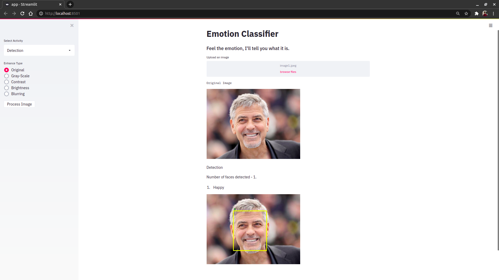

# Real-time Emotion Recognition

# Introduction
This is an attempt to perform emotion recognition from facial expressions. There is added functionality to format the image as required. The model will run on the formatted image. This is a classification model, which classifies the input into 7 human emotions, namely Anger, Happy, Sad, Neutral, Disgust, Surprise and Fear. 
I built a streamlit app to deploy my model (only on images). The code was extended to function in real time (for videos and webcam feed). 

# Implementation
The MTCNN library in python was used for face detection in the input feed. The faces were cropped and passed through the model to classify it into one of the emotions mentioned above. The model was built and implemented in Keras with a tensorflow backend. The model is deployed on streamlit. The Website can be run on the local server by running the following commands:

```
git clone https://github.com/eklavyaj/Real-time-Emotion-Recognition/
cd Real-time-Emotion-Recognition/
```
Install the requirements using (one may create a new conda enviroment):
```
pip install -r requirements.txt
```
Launch the app using the following command:
```
streamlit run app.py
```


# Website Preview
There have been some changes in the deployment, you may view it locally by following the above steps. 



# License

This project is licensed under the [MIT License]("license). 
